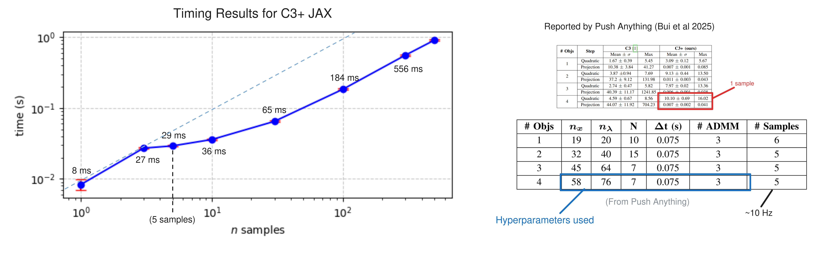

# C3+ in JAX

This repo implements [C3+](https://dairlab.github.io/push-anything/) in [JAX](https://docs.jax.dev/en/latest/) for GPU parallelization. It runs very fast because the QP step is solved via Shur's complement and Cholesky solves. Here is a graph of the timing of this implementation of C3+ with the same parameters reported by Push anything for 4 objects:




## Getting Started

Install dependencies

```sh
uv venv -p 3.12
source .venv/bin/activate
uv pip install -r requirements.txt
uv pip install .
```

Then you can run the example

```sh
uv pip install matplotlib scipy tqdm
uv pip install https://github.com/AndyLamperski/lemkelcp.git
python examples/cartpole_with_soft_walls.py
```

Or use it C3+ your own

```py
from c3p_jax import (
    LCSMatrices, create_rho_schedule, C3Problem, c3p_jit, C3Solution
)

...

sol: C3Solution = c3p_jit(c3_problem, T, n_iter)
```

